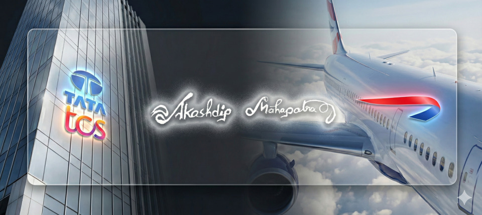
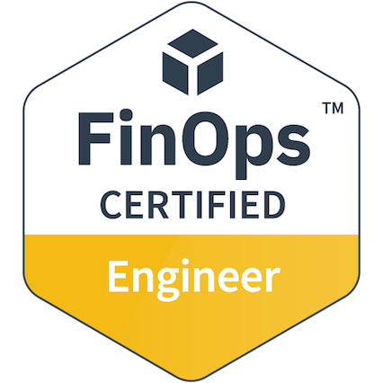
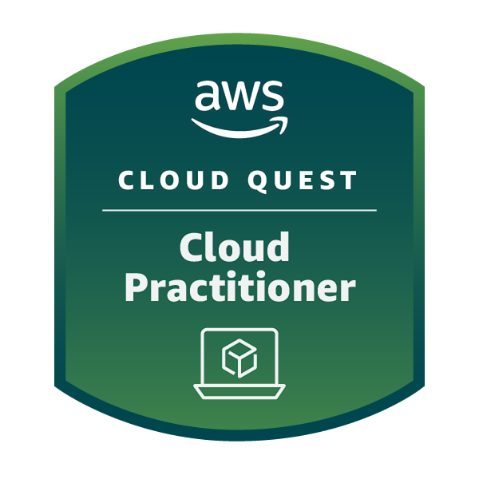

  
    
  

  
  
  
  
  
  
  
  
  
  
  
  
  
  
  
  
  

 

  

  

 

### 🚀 About Me: From Mechanical Design to Cloud Architecture
My engineering journey started in the physical world. With a background in Mechanical Engineering and a recognized passion for illustration (honored with a National Award from the President of India in 2012 & 2017), I have always loved breaking down how complex systems fit together. 

Today, I apply that same spatial reasoning and structural mindset to distributed cloud systems, DevOps pipelines, and Site Reliability Engineering (SRE). I specialize in automating away operational toil, securing infrastructure, and managing highly reliable enterprise environments (currently managing 50+ distributed compute nodes and high-throughput event streams).

---

### 💻 Tech Stack & Tools

**Core Infrastructure & DevOps:**  

**Languages, Backend & Databases:**  

**System Tools & Environments:**  

**AI & GenAI:**  
  

> Foundations → APIs → Prompting → Local LLMs → Agents → RAG → 
> Async Queues → Multimodal → LangGraph → Memory (Vector + Graph) → Voice

---

### 📈 Key Engineering Impact (Last 6 Months)
Since transitioning into a dedicated enterprise DevOps role, I have focused heavily on eliminating operational toil through automation. My recent workflow architectures have generated the following verified time-savings:

* **Automated Post-Deployment Validation:** Replaced a manual log-checking checklist with an AWS-native Python engine.
  * **Impact:** Reduced QA sign-off time from **30 minutes to under 5 minutes**.
* **Zero-Touch UAT Health Checks:** Engineered an automated health-check pipeline to validate environment integrity without requiring senior engineer intervention.
  * **Impact:** Reduced environment validation time from **1.5 hours to ~5 minutes**.
* **1-Click Vulnerability Remediation (DevSecOps):** Designed a CI/CD workflow that handles environment setup, terminal execution, and deployment for patching CVEs.
  * **Impact:** Reduced critical patching lifecycle from **1 full day of manual effort to 30 minutes** of automated background processing.
* **Event-Driven Data Seeding:** Automated manual S3 bucket data-dump processes that previously required data analytics and SQL expertise. 
  * **Impact:** Reduced trigger time from **30 minutes to 2 minutes**, democratizing the process for non-data engineers.

---

### 🧠 The Engineering Mindset: Beyond the Defaults
I believe in understanding *why* a technology exists, not just *how* to use it. When I am not building infrastructure, I am deep-diving into the mechanics of next-generation tools:
* **Event Streaming at Scale:** Researching how massive platforms handle throughput bottlenecks beyond standard Kafka implementations.
* **Deep OS Troubleshooting:** Going beyond standard administration by utilizing `strace` for system calls, tracking inode allocations, and performing packet forensics with `tcpdump` and Wireshark.
* **Version Control Under the Hood:** Analyzing Meta’s *Sapling* to understand how data structures and historical node snapshots operate differently from standard Git architecture.

### ⚡ Current Focus & Continuous Learning
* **Orchestration:** Transitioning deeper into container orchestration by exploring **Kubernetes (K8s)** and multi-stage Docker optimization.
* **Backend Engineering:** Expanding my architectural scope by building Python-based web backends (including bypassing frameworks to build raw HTTP servers using basic TCP sockets).
* **Algorithms:** Consistently sharpening my problem-solving efficiency and data structures knowledge.

* **Agentic AI & GenAI Engineering:** Building production-grade GenAI systems. Experience includes **LangGraph-based agentic workflows**, hybrid memory architecture (Semantic/Episodic via **Qdrant** + Relational via **Neo4j** & **mem0**), scalable asynchronous RAG pipelines using **Redis/Valkey** message queues, and building Multimodal/Voice-controlled agents using OpenAI and local (Ollama) models.

 

**Catch up on my latest algorithmic problem-solving:**
 

---

### 🛠️ Enterprise Cloud & DevOps Impact 
> *Note: Due to strict corporate NDAs and security policies, specific enterprise project code is maintained in private repositories. Below are high-level overviews of the architectural challenges I solve in production environments.*

#### 1. Infrastructure & Deployment Automation
* **Zero-Touch QA Validation Engine:** Engineered an AWS-native Python automation tool using `boto3` to dynamically discover cloud resources at runtime. Integrated with CloudWatch and Datadog to automate deployment health checks, reducing manual sign-off time from ~30 minutes to under 2 minutes while enforcing a zero-error baseline.
* **High-Throughput Data Pipelines:** Manage secure, event-driven pipelines (Amazon MSK/Kafka) and public-facing APIs, ensuring reliable delivery for downstream B2B applications processing 200 GB to 500 GB of data daily.

#### 2. Cloud FinOps & Observability
* **Proactive System Monitoring:** Lead Platform L2 shift support by managing sophisticated Datadog monitors across 5 environments, tracking compute capacity, broker health, and cluster utilization to maintain near-zero deployment downtime.
* **Cost Anomaly Root Cause Analysis:** Triaged runaway AWS billing alerts by cross-referencing CloudWatch metrics with CloudTrail logs. Identified and severed an infinite synchronous retry loop within an event-streaming architecture, proposing permanent architectural safeguards.

#### 3. Application Security & Cloud Hardening (DevSecOps)
* **Vulnerability Remediation (CVEs):** Spearheaded DevSecOps remediations to patch critical vulnerabilities in containerized serverless deployments. Implemented multi-stage Docker builds to harden security and achieved a 42% image size reduction (607MB to 350MB).
* **IAM Least-Privilege Enforcement:** Authored and deployed Terraform configurations to systematically re-route AWS IAM permissions and manage VPC endpoints, ensuring seamless transitions without service interruption.

 

---

## 🏆 Recognition & Awards

### TCS Gems — Star of the Month Award
*Awarded by Tata Consultancy Services | July 2026*

> *"In appreciation of your outstanding contribution to the organisation"*  
> — Sudeep Kunnumal, Chief Human Resources Officer, TCS

---

 

  
  &nbsp;&nbsp;
  

  
  
<i>"Success looks good on paper, but experiences truly make you feel alive. Fail, learn, and repeat."</i>

---

 
  

     &nbsp; 
    
  

   
    
  📂 <b>Personal Archive & Academic Projects: (2021 - 2025)</b>

---

