<!--  -->

[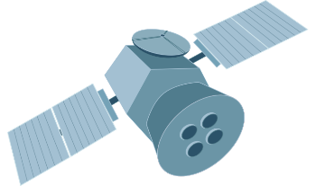](https://www.credly.com/users/akashdip2001)

<!-- <a href="https://www.credly.com/go/6C69ZOKh">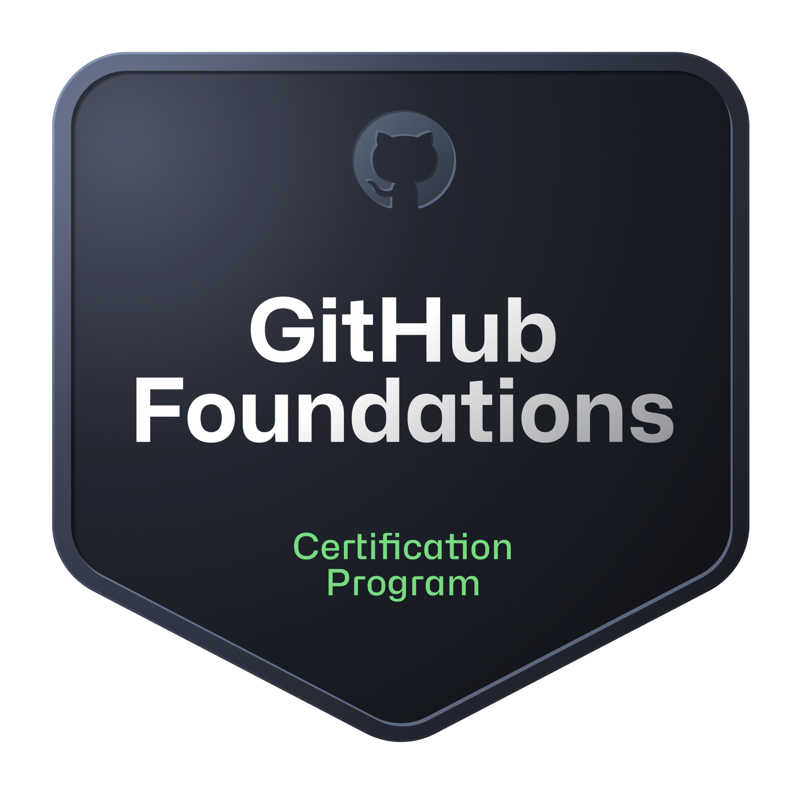</a> -->
<a href="https://www.linkedin.com/posts/akashdip2001_macbook-desktop-github-activity-7286721666125119488-G-B4">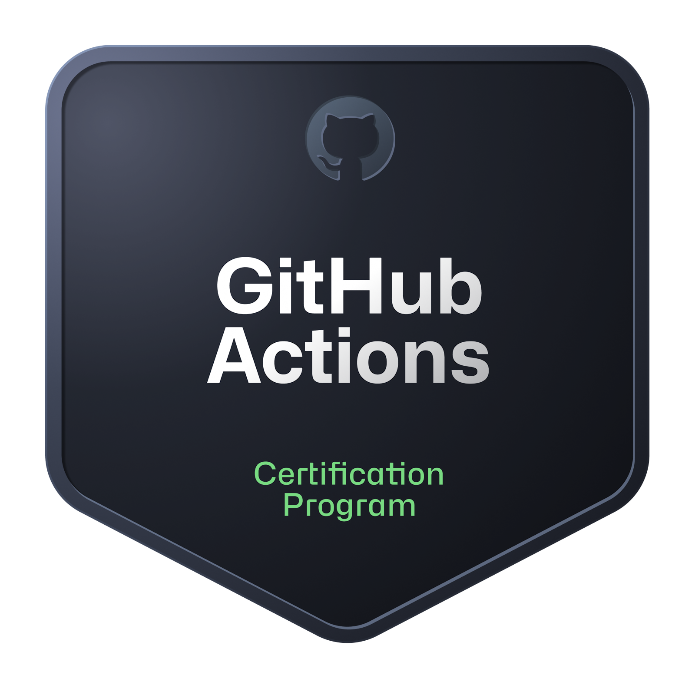</a>

 
 
&nbsp;
&nbsp; &nbsp;

&nbsp;
<a href="https://www.credly.com/users/akashdip2001">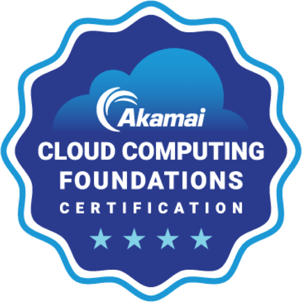</a>
 
 

  
<b>more Badges 🥇</b>
 
  
 &nbsp; &nbsp;
    &nbsp; &nbsp;
    &nbsp; &nbsp;
   <a href="https://www.credly.com/badges/998c7f5e-7081-4cd7-b8ee-153ece4d89f0/public_url">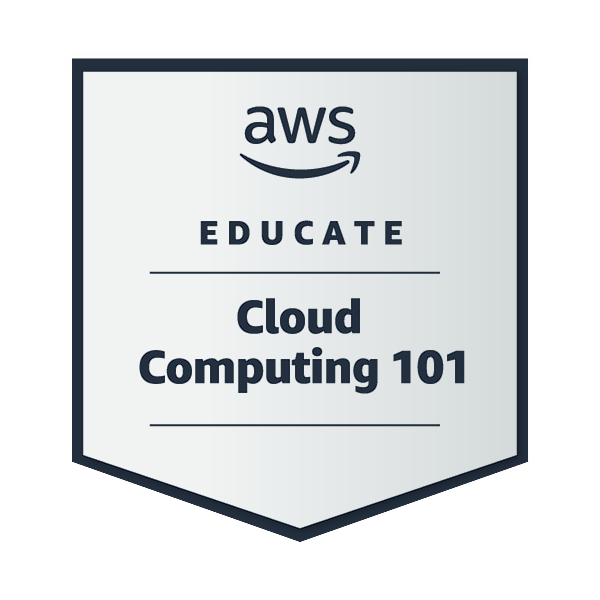</a>
   <a href="https://www.credly.com/badges/02600532-734a-44c4-954a-bc03105fa653/public_url">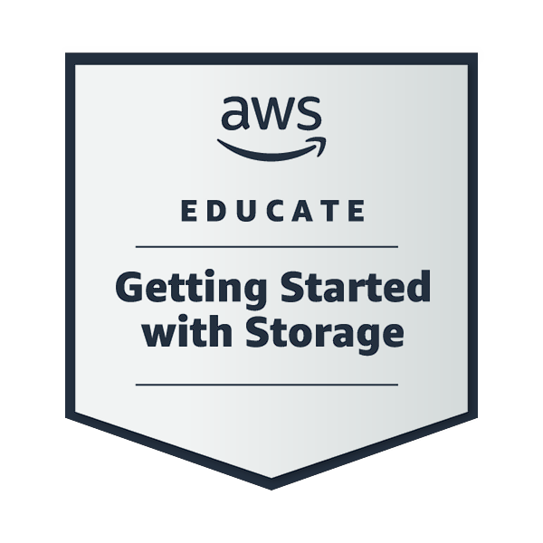</a>
   <a href="https://www.credly.com/badges/6ea09b08-c1f7-4035-ae3b-bf921004d224/public_url">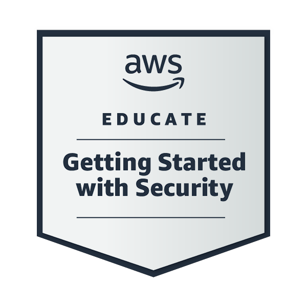</a>
   <a href="https://www.credly.com/badges/e715c31c-d92a-4920-ae9c-ab40e4ed660a">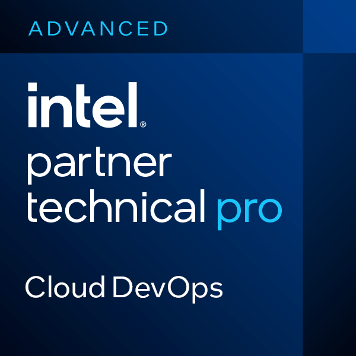</a> &nbsp;
   <a href="https://www.linkedin.com/posts/akashdip2001_ibm-cloud-computing-activity-7284828863606484992-LYd4">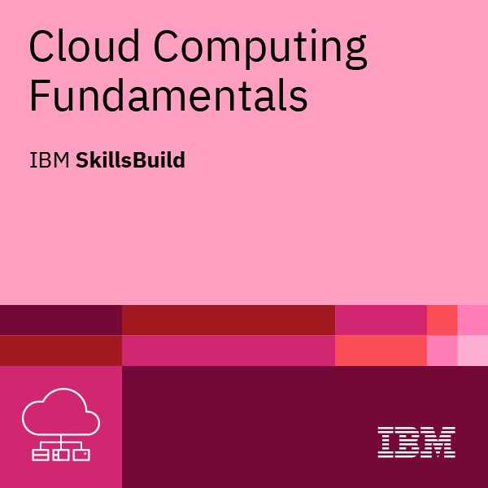</a> &nbsp;
   <a href="https://www.credly.com/badges/a87e2321-76c6-4800-a0de-f3af0917d99b/public_url">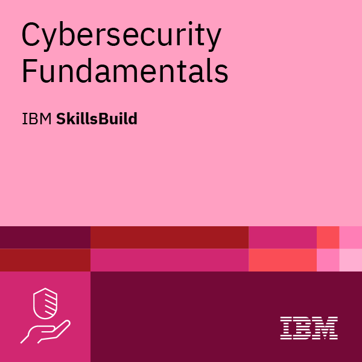</a> &nbsp;
   
   
     
   
   
   
   <a href="https://www.linkedin.com/posts/the-linux-foundation-training-%26-certification_iac-opentofu-devops-activity-7280661407161860096-SSSJ">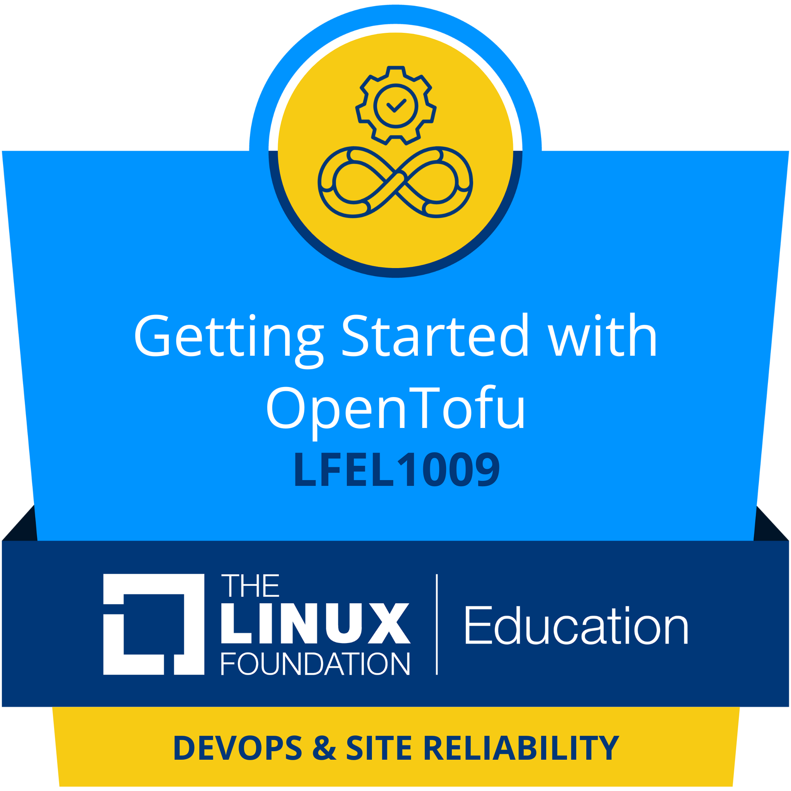</a>
   
   
   
   
   <a href="https://www.linkedin.com/posts/akashdip2001_guinnessworldrecords-aiskillsfest-microsoftlearn-activity-7323753706363981825-uL_1">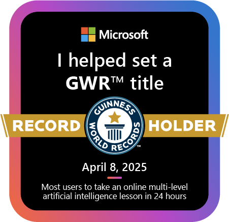</a>

 
 

 ---
 
#### AI certificates 

---

 
 

   
   <a href="https://www.salesforce.com/trailblazer/akashdipmahapatra">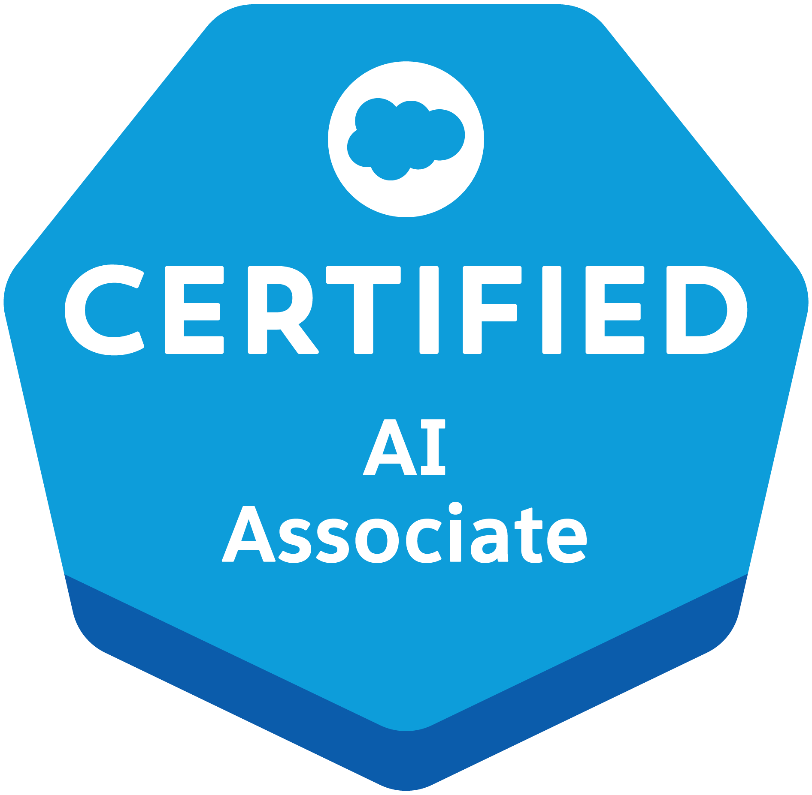</a>
   
   
   
                                                         
    

---
   
    
     
    

   
   

    
<b>☁️ Google Cloud Badges 🥇</b>
 
    
    
   
    
      
    
    
    
    
  

  

 
 [Verify all Badges : ](https://www.credly.com/users/akashdip2001)

<!--    -->

 

 
 <!--

  

 -->
<h3 src="https://youtu.be/ysBF9EfvWkk?t=428" align="center">National award from Dilhi, award taken from Indian precedent Pronob Mukherjee 2012 , on Drawing</h3>

    

  

---

 
 

  
# ⭐ Credly [**`achievements`**](https://www.credly.com/users/akashdip2001) ⭐

 

 
 

 

 
 

 ---
 
# All office **Jira Tasks** 
#### [old collage projects `link`](https://github.com/akashdip2001/akashdip2001?tab=readme-ov-file#projects001) : collage Time GitHub account

---

 
 

> This is a one small part of a complete Data Product, one of many Data Products in a M1 AWS cluster - Click to see the [working account](https://github.com/AkashdipMahapatra-BA)

  
 

  
<b>M2 cluster</b>
 
 

> **current project** - (British Airways) TCS, 2025 - 2026 , Click to see the [working account](https://github.com/AkashdipMahapatra-BA)  
> **NB:** This is a over-view understanding of my current working project - **This is not a actual LLD**.

### ⚡ Fun Fact / Current Focus: I recently transitioned into the DevOps space, and my favorite part so far is being a "sponge" during massive enterprise migrations. While I'm mastering the fundamentals, I'm actively sitting in on cross-squad migration groups (like our MSK Migration task force). I might not be writing all the final migration scripts yet, but I'm absorbing the architecture, the planning, and the problem-solving required to move critical data products without breaking a sweat!

 

> Some ss from our Enterprise project Mogration, Infront of my eye.

 
 

---

 
 

 ---
 
# ⚙️ Infrastructure & Workflow Automation ⚙️

> Scripts, pipelines, and tools built to eliminate operational toil and accelerate CI/CD workflows.

---

 

| Automation Task | Architecture & Implementation | Technical & Business Impact | Links & Stack |
|---|---|---|---|
| **Post-Deployment Validation Automation**    *Goal: Automate the manual 20-30 min QA deployment checklist for any ODIE Data Product using a single, reusable workflow.* | **AWS-Native Dynamic Discovery:** Python engine uses `boto3` to auto-discover all Lambdas (`list_functions`), SNS Topics (`list_topics`), and API Gateways (`get_rest_apis`) at runtime — no cross-repo cloning or GitHub App tokens required. Only two inputs needed: `data_product` and `environment`.  **Precision Timeframe Isolation:** Deployment time is auto-detected from Lambda `LastModified` timestamp, with ECR image push time as fallback (extracted directly from Lambda's `Code.ImageUri`).  **Observability Integration:** Queries **CloudWatch Metrics** for Lambda invocations/errors/throttles with pre-vs-post deployment traffic comparison. Performs **server-side CloudWatch Log filtering** for error patterns. Validates **SNS subscription health** (detects PendingConfirmation/deleted topics) and **API Gateway** availability via HTTP health checks.  **Hybrid Configuration:** Auto-discovered resources are merged with manual `config.json` overrides using O(1) deduplication, ensuring non-standard resources are never missed.  **Automated Reporting:** Generates a formatted Excel checklist with PASS/FAIL per resource, a dedicated Critical Errors sheet, and per-Lambda error CSVs for JIRA evidence. | **Technical Impact:** Replaced manual CloudWatch console log-checking with deterministic, zero-error baseline enforcement. Standardised the Dev sign-off process across all data products with a single reusable workflow. Enforced zero-tolerance policy for Lambda errors/throttles (auto-fails the CI/CD pipeline).  **Business Impact:** Reduced deployment validation `from ~20-30 minutes of manual effort to ~2-3 minutes` of automated execution. Accelerated the Change Request pipeline and significantly lowered the risk of regressions reaching production. Provided audit-ready Excel evidence for upstream team accountability. | <ul><li>[Jira - Design & Architecture](https://britishairways.atlassian.net/browse/IIDIP-23046)</li><li>[Jira - Implementation & Testing](https://britishairways.atlassian.net/browse/IIDIP-23574?atlOrigin=eyJpIjoiM2ZmY2Q5Mzg5NjBmNGU5ODlhYTkzMTQ3ZmU1MGMyYmYiLCJwIjoiaiJ9)</li><li>[Pull Request](https://github.com/BritishAirways-Ent/ops-odie-datapipeline-gse-event-details/pull/197)</li><li>[Workflow](https://github.com/BritishAirways-Ent/ops-odie-datapipeline-gse-event-details/actions/workflows/deployment-validation.yaml)</li><li>[official Documentation](https://britishairways.atlassian.net/wiki/x/0QLoP)</li></ul>   `Python`, `Boto3`, `GitHub Actions`, `AWS CloudWatch`, `AWS Lambda`, `AWS SNS`, `AWS ECR`, `AWS API Gateway`, `Pandas`, `OpenPyXL`, `CI/CD Automation` |

 

 
<!--  -->

    
    

 
 

 ---
 
# 💲 AWS Cost Anomaly & Architecture Root Cause Analysis 💲

> AWS Billing and Cost Management, AWS CloudTrail, AWS CloudWatch

---

 

| Automation Task | Architecture & Implementation | Technical & Business Impact | Links & Stack |
|---|---|---|---|
| **AWS Cost Anomaly & Architecture RCA**    *Goal: Resolve runaway AWS billing alerts across Lambda, MSK, and EC2 via deep telemetry analysis.* | **Telemetry Correlation:** Cross-referenced CloudWatch Metrics (Invocations, AsyncEventAge) with large-scale CloudTrail logs to isolate infrastructure changes and filter regional noise.  **Loop Diagnosis:** Uncovered a synchronous Lambda-MSK retry loop triggered by an IAM `AccessDenied` error following a Kafka client library upgrade.  **Architecture Audit:** Traced a permanent cost baseline shift to manual `PutProvisionedConcurrencyConfig` executions, changing a Lambda from pay-per-request to 24/7 billing. | **Technical Impact:** Stopped active runaway costs by identifying abandoned EC2 instances and severing the event loop. Proposed architectural safeguards including DLQs and MSK retry limits.  **Business Impact:** Provided management with definitive data distinguishing between temporary incident burn and permanent architectural upgrades, enabling accurate cloud budgeting. | <ul><li>[Jira link](https://britishairways.atlassian.net/browse/IIDIP-23289)</li><li>[View `documentation` Repo](https://github.com/AkashdipMahapatra-BA/Task-12-AWS_Cost_Anomaly_RCA)</li></ul>   `AWS CloudTrail`, `AWS CloudWatch`, `AWS Lambda`, `Amazon MSK`, `FinOps`, `Python/Pandas` |

 

 
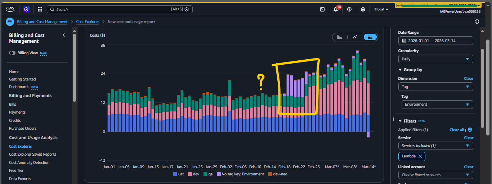
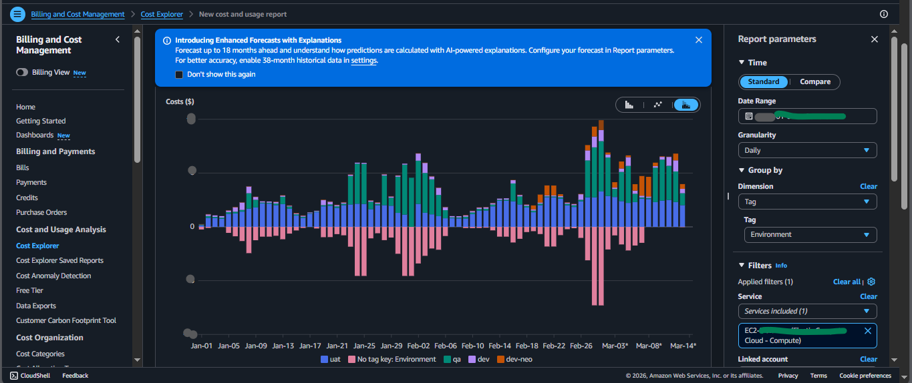

 
 
 

 ---
 
# ⚙️ Other Jira Tasks ⚙️

---

 

| Task Name & Goal | Architecture & Implementation | Technical & Business Impact | Links & Stack |
|---|---|---|---|
| **CI/CD Pipeline RCA & Architecture**    *Goal: Diagnose and unblock CI/CD test failures.* | **Event-Driven Pipeline:** S3 → EventBridge → Lambda container ETL.  **Root Cause Analysis:** Investigated and resolved pytest test-discovery and import-time execution issues.  **Fixes:** Implemented pytest fixtures, proper `NaN` handling, and improved mocking. | **Technical Impact:** Fixed deployment blockers and stabilized test execution.  **Business Impact:** Restored pipeline integrity and improved tooling reliability for the engineering team. | [View Repo](https://github.com/AkashdipMahapatra-BA/Root-cause-analysis--CI-CD-fails)    `CI/CD`, `RCA`, `AWS Lambda`, `S3`, `EventBridge`, `Python`, `Pytest` |
| **M1.0 Non‑PII Feed QA Sign‑Off**    *Goal: Validate data quality for Cabin Crew Schedules.* | **Pipeline Validation:** Tested S3 → EventBridge → Lambda → SNS FIFO → SQS FIFO.  **Execution:** Ran 15 NOT NULL negative validations and checked schemas against the Confluence Data Dictionary.  **Observability:** Tracked DLQ routing via CloudWatch Logs Insights. | **Technical Impact:** Built a repeatable QA harness using a dedicated SQS FIFO queue.  **Business Impact:** Ensured downstream data reliability and provided documented sign-off evidence. | <ul><li>[Jira](https://britishairways.atlassian.net/browse/IIDIP-21844)</li><li>[Repo](https://github.com/AkashdipMahapatra-BA/Task-10---QA-validation-for-non-PII)</li><li>[`Published` Confluence](https://britishairways.atlassian.net/wiki/spaces/IO/pages/104217839/Cabin+Crew+Schedules+-+Data+Dictionary)</li></ul>   `AWS S3`, `EventBridge`, `Lambda`, `SNS/SQS FIFO`, `CloudWatch` |
| **M1.0 Non-PII API Data Validation**    *Goal: Validate data integrity and PII hashing for Cabin Crew Details.* | **Pipeline Validation:** Tested S3 → EventBridge → MSK (Kafka) → API Gateway.  **Execution:** Built a Python automation script (`deepdiff`) for 1:1 payload comparison, verifying strict SHA-256 hashing of sensitive fields across 2,500+ records.  **Observability:** Validated AVRO format serialization in raw and curated Kafka topics. | **Technical Impact:** Automated manual JSON comparison processes, accelerating QA regression testing and eliminating human error.  **Business Impact:** Certified the secure obfuscation of PII data for downstream consumers, meeting strict Pathfinder security requirements. | <ul><li>[Jira](https://britishairways.atlassian.net/browse/IIDIP-23424)</li><li>[Repo](https://github.com/AkashdipMahapatra-BA/Task-10-Test_API_created_for_Non-PII_feed)</li><li>[`Published` Confluence](https://britishairways.atlassian.net/wiki/x/DQGQNw)</li></ul>   `AWS API Gateway`, `MSK (Kafka)`, `Python`, `Postman`, `Lambda` |
| **Datadog Observability & RCA**    *Goal: Diagnose production data pipeline anomalies.* | **SNS Failures:** Correlated Datadog metrics and CloudWatch to find orphaned `.fifo` subscriptions pinging deleted SQS queues.  **S3 4xx Errors:** Isolated `NoSuchKey` errors to missing daily data partitions causing concurrent Lambda crashes. | **Technical Impact:** Created deep-dive operational runbooks for serverless architectures.  **Business Impact:** Reduced alert noise and improved incident response times for production pipelines. | [View Repo](https://github.com/AkashdipMahapatra-BA/Datadog-works)    `Datadog`, `AWS SNS/SQS`, `AWS S3`, `CloudWatch Logs Insights`, `RCA` |
| **Vulnerability Fix (DevSecOps)**    *Goal: Remediate critical CVEs in containerized Lambdas.* | **Remediation:** Fixed 3 critical CVEs via dependency upgrades (pip, gnupg2).  **Optimization:** Implemented multi-stage Docker builds to restructure Dockerfiles.  **Validation:** Used CloudWatch metrics and ECR image analysis to verify deployments. | **Technical Impact:** Hardened container security and achieved a 42% image size reduction (607MB → 350MB).  **Business Impact:** Mitigated security risks and reduced AWS Lambda cold-start overhead. | [View Repo](https://github.com/AkashdipMahapatra-BA/fix-vulnerabilities)    `Docker`, `GitHub Actions`, `AWS ECR`, `AWS Lambda`, `Security/CVE` |
| **Kafka Partition Learnings**    *Goal: Master event streaming system fundamentals.* | **System Design:** Conducted architectural experiments focusing on Kafka partitioning, throughput, and ordering.  **Infrastructure:** Deployed test environments using AWS ECS, EC2, and S3. | **Technical Impact:** Built strong, hands-on fundamentals for scaling distributed systems.  **Business Impact:** Established core knowledge to support reliable, high-throughput data engineering. | [View Repo](https://github.com/AkashdipMahapatra-BA/Kafka-Partition-Reduce)    `Kafka`, `AWS ECS`, `AWS EC2`, `AWS S3`, `Distributed Systems` |
| **Post-Deployment Validation**    *Goal: Automate manual QA checklist for deployments.* | **Event-Driven Execution:** GitHub Actions dynamically triggers a Python health-check script.  **Observability:** Uses `boto3` for CloudWatch metrics and `datadog-api-client` to verify zero monitor failures.  **Reporting:** Generates a structured JSON/Excel deployment checklist. | **Technical Impact:** Eliminated manual log-checking toil and enforced a zero-error baseline.  **Business Impact:** Accelerated the Change Request pipeline and significantly lowered regression risks. | <ul><li>[Jira](https://britishairways.atlassian.net/browse/IIDIP-23046)</li><li>[Repo](https://github.com/AkashdipMahapatra-BA/Task-11---Automation)</li></ul>   `Python/Boto3`, `GitHub Actions`, `AWS CloudWatch`, `Datadog API` |
| **Secure Data Feed Migration (GTA)**    *Goal: Transition consumer endpoints from PII to anonymized non-PII data feeds.* | **IaC Configuration:** Authored Terraform updates to securely re-route AWS IAM resource permissions.  **Deployment Pipeline:** Synced configurations systematically across UAT and Production environments.  **Validation:** Validated changes via GitHub Actions CI/CD and managed the formal deployment lifecycle via ServiceNow. | **Technical Impact:** Maintained seamless data delivery while safely deprecating legacy sensitive data access.  **Business Impact:** Enforced strict enterprise data security standards and successfully navigated the Change Advisory Board (CAB) approval process. | <ul><li>[Jira](https://britishairways.atlassian.net/browse/IIDIP-23409)</li></ul>   `Terraform`, `AWS IAM`, `GitHub Actions`, `ServiceNow` |
| [`Onboarding`]()    **Secure Data Feed Migration (GTA)**    *Goal: Transition consumer endpoints from PII to anonymized non-PII data feeds.* | **IaC Configuration:** Authored Terraform updates to securely re-route AWS IAM resource permissions.  **Deployment Pipeline:** Synced configurations systematically across UAT and Production environments.  **Validation:** Authored enterprise-standard implementation plans, secured senior engineer validation, and managed the CAB approval lifecycle via ServiceNow. | **Technical Impact:** Maintained seamless data delivery while safely deprecating legacy sensitive data access.  **Business Impact:** Enforced strict enterprise data security standards and mastered cross-functional enterprise deployment workflows. | <ul><li>[Jira](https://britishairways.atlassian.net/browse/IIDIP-23409)</li><li>[Repo](https://github.com/AkashdipMahapatra-BA/Task-13_Onboarding)</li></ul>   `Terraform`, `AWS IAM`, `GitHub Actions`, `ServiceNow` |
| [API `Onboarding`]() & [`Off-boarding`]()    **Multi-Environment API Consumer Onboarding (Pathfinder)**    *Goal: Onboard Pathfinder team APIs across UAT & Prod, and off-board deprecated Collab accounts.* | **IaC Configuration:** Authored Terraform updates to whitelist 16 VPC Endpoints (4 envs × 4 types: ecs, ecs_agent, ecs_telemetry, execute_api) and onboard IAM consumer roles across UAT and Production API Gateways.  **Principal Validation:** Individually validated 15+ IAM role ARNs across 7 AWS accounts by testing against KMS key policy constraints, filtering out non-existent principals before deployment.  **Off-boarding:** Securely removed deprecated IAG account (533267015508) roles and VPCEs as a separate change lifecycle.  **Troubleshooting:** Diagnosed and resolved `ACLSizePerRole: 2048` IAM quota limits and `MalformedPolicyDocumentException` errors during deployment. | **Technical Impact:** Mastered cross-account IAM trust policy management, KMS key policy principal validation, and API Gateway resource policy (aws:SourceVpce) whitelisting at scale.  **Business Impact:** Enabled Pathfinder team access to Cabin Crew Ground Activities, Cabin Crew Details, Cabin Crew Schedules, OpDefs, Revisions, Notifications, and Flight Crew APIs — while simultaneously enforcing least-privilege by off-boarding legacy accounts. | <ul><li>[Jira - Onboarding](https://britishairways.atlassian.net/browse/IIDIP-23566)</li><li>[Jira - Off-boarding](https://britishairways.atlassian.net/browse/IIDIP-23652)</li><li>[Repo](https://github.com/AkashdipMahapatra-BA/Task-13_Onboarding/tree/main/02%20%5BAPI%20Onboarding%5D-%5BPathfinder%5D-Cabin%20Crew%20ground%20activities%2C%20Cabin%20Crew%20Details%20and%20Cabin%20Crew%20Schedules%20APIs%20in%20UAT%20and%20Prod)</li></ul>   `Terraform`, `AWS IAM`, `AWS KMS`, `API Gateway`, `VPC Endpoints`, `GitHub Actions`, `ServiceNow` |
| **Platform L2 Shift Support & Incident Triage**    *Goal: Manage weekend operational health for the Mercury 1.0 ODIE platform.* | **Observability:** Monitored 60+ Datadog monitors across 5 environments, tracking AWS Redshift capacity, MSK broker health, and ECS cluster utilization.  **Incident Management:** Executed strict routing workflows for unassigned ServiceNow incidents, cross-referencing Confluence KB runbooks and GitHub Terraform repositories to separate Platform vs. Product issues.  **Security Validation:** Conducted routine AWS Inspector and GuardDuty health checks across Dev and Prod. | **Technical Impact:** Maintained weekend platform stability and formally documented known MSK Kafka CPU flapping anomalies for upstream engineering action.  **Business Impact:** Bridged the gap between L2 operational support and L3 engineering, ensuring zero unassigned incidents during the shift. | [View Report](https://github.com/AkashdipMahapatra-BA/One_day-with-Platform_team)    `Datadog`, `ServiceNow`, `AWS MSK`, `AWS Inspector`, `Incident Response` |

 ---
 
# 🛡️ Application Security & Code Hardening 🛡️

> TCS contest

---

 

| Event / Project | Description & Remediations | Link | Tags |
|---|---|---|---|
| **TCS CodeSecure2 Hackathon: Django Security Audit** | Conducted a comprehensive static code analysis and manual security remediation for a monolithic Django application (Sales & Inventory Management). Successfully identified and patched **27 critical vulnerabilities** mapping to the OWASP Top 10.  **Key Vulnerabilities Remediated:**<ul><li>**Injection Flaws (SQLi & OS Command):** Replaced raw SQL execution (`cursor.execute`) with secure, parameterized Django ORM queries. Completely removed multiple instances of OS Command Injection by stripping unsafe `subprocess.check_output()` calls tied to URL parameters.</li><li>**Insecure Deserialization & File Uploads:** Prevented Remote Code Execution (RCE) by migrating unsafe `pickle.loads()` data parsing to secure `json.loads()`. Patched Arbitrary File Read (SSRF) and Path Traversal flaws in file-handling views.</li><li>**Broken Access Control & IDOR:** Eradicated hidden backdoor login routes. Secured API endpoints by removing unauthorized state-changing `GET` methods and enforcing strict authentication decorators (`@login_required`, `LoginRequiredMixin`) to prevent Insecure Direct Object References (IDOR) on sensitive invoice downloads.</li><li>**Global Configuration Hardening:** Hardened `settings.py` by disabling `DEBUG` mode, securing session cookies (`HTTPOnly`), removing wildcard `"null"` CORS misconfigurations, enforcing Clickjacking middleware (`X_FRAME_OPTIONS`), and externalizing hardcoded secret keys.</li></ul> | [Repo](https://github.com/AkashdipMahapatra-BA/CODESECURE-SEASON-2) | use <ul><li>Python / Django</li><li>Code Review</li><li>OWASP Top 10</li></ul> `AppSec`, `Vulnerability Remediation`, `DevSecOps`, `SQLi`, `Command Injection`, `IDOR`, `Deserialization`, `CORS`, `Security Audit` |

 
 

### Repository `Visibility Notice`.

   - Some repositories may currently appear as [private]() or return a [404 error]().       
   - This is `intentional`. As I am presently part of an organization, I periodically restrict repository visibility to ensure full compliance with **corporate policies**, **confidentiality standards**, and **professional ethics**.
   - If you are a recruiter or engineer interested in reviewing my work, feel free to contact me directly, and I’ll be happy to discuss my experience and learning approach.

 
 

  
<b>my interest</b>
 
 

---
 
These repositories reflect my learning journey and engineering mindset, and they continue to evolve as I gain deeper exposure to `DevOps`, `Cloud`, `Security`, and `Distributed Systems`.

---

